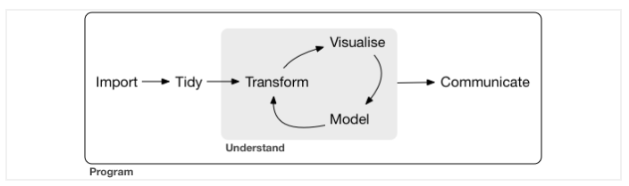

# R-for-Data-Science
Notes:

 - For small data-sets (1-2 GB)
 - For larger datasets (10-100 GB): Learn https://github.com/Rdatatable/data.table



## Plotting Data

```
ggplot(data = <DATA>) + 
    <GEOM_FUNCTION>(mapping = aes(<MAPPINGS>))
```
